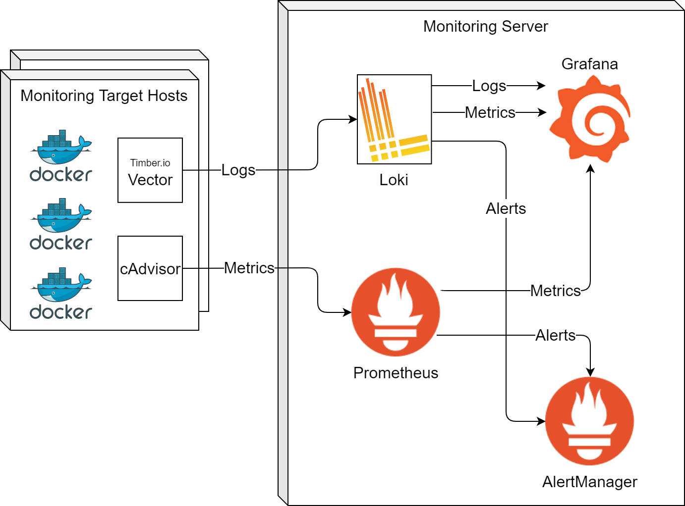

# Introduction
With the growth of micro-service based architectures, the points of failures have distributed across multiple applications and servers. This raises a need for an active monitoring solution that helps the administrators and the application developers to know the failures before even the users of the systems notice it. In this blog we briefly introduce the responsibilities of the monitoring system followed by a brief guidance to Prometheus and Loki based monitoring infrastructure.


## Motivation

 What is the importance of distributed monitoring?
Monitoring infrastructure can help in the following aspects:
### 1. Identification of faults: 
Faults such as network failures, unavailability, application exceptions resource overload are unpreventable while running a complex IT infrastructure. Monitoring helps in identifying the faults so that they are addressed on time. sometimes, it is not just about the faults that has occured already, rather it may be about the faults that are about to occur. The monitoring system should facilitate the identification of possible faults by providing interactive dashboards and by providing timely alerts. The fault identification involves indication of existence of a fault and sometimes showing the exact point of failure. 
### 2. Debugging
Debugging an identified problems need a deep investigation with respect to the occured fault or an event. This sometimes needs different factors which revolve around the deployed service viz. CPU usage, internal logs, network transmissions, memory usage  and exceptions. Monitoring dashboards makes such information available to the debuggers without much efforts of manual extraction. Monitoring the logs accelerate the debugging provided there is a provision for visualization and filtering of logs.
### 3. Data Driven Insights
Analyzing the long term and short term data collected for a running service add multitude of strategical benefits. Historical data showing the resource usage of a service over time assists in the decision related to acquision of the software, comparing the alternatives, scaling up/down the infrastructure. 

Now that we listed out the overall purpose of the monitoring, a typical monitoring tool would provide mainly monitoring and reporting functinalities. Monitoring involves the gathering of various metrics and logs. Reporting involves the visualization and alerting based on the collected metrics. 
Optionally monitoring tools can also perform certain administrative actions such as resource optimization (e.g. [Amazon Cloudwatch](https://aws.amazon.com/cloudwatch/)), providing remote management tooling ([NinjaRMM](https://www.ninjarmm.com/)) and IT workflow automation ([OpManager](https://www.manageengine.com/network-monitoring/)).
## Overview
In this blog we talk about the monitoring using ope [Prometheus](https://prometheus.io/) and [Grafana Loki](https://grafana.com/oss/loki/). 
After reading this blog, the reader should be able to perform the following tasks:
1. **Metrics Monitoring:** Metrics collected from the containers running on different hosts includes CPU mamory usage and network transactions. We shall achieve this using Prometheus. 
2. **Log Management:** Logging gives an insight to the running applications and their behaviour. This can be used by the service providers to deduce the causes for malfunctioning and to get an overview of the client behavior. We realize this using Loki.
3. **Visualization and Alerting**: Monitored metrics and logs are visualized and explored using different Grafana panels. [Alertmanager](https://prometheus.io/docs/alerting/latest/alertmanager/) is used to manage the alerts generated by Prometheus
# Deployment and Data Flow
The figure below shows a monitoring infrastructure deployment where a Monitoring server monitors different target hosts running in local or remote premises. Prometheus, Loki, Grafana and Alertmanagers are installed on the Monitoring server. The target hosts are installed with [vector](https://github.com/timberio/vector) and [cAdvisor](https://github.com/google/cadvisor) to extract the logs and metrics respectively from the target hosts. Vector collects the docker logs and cAdvisor collects different docker metrics. Prometheus scrapes the metrics from cAdvisor. Loki on the other hand does not have a scraping mechanism and hence the logs are pushed by vector to Loki. Both metrics (collected by Prometheus) and logs (collected by loki) are visualized using Grafana. Generated alerts are forwarded to Alertmanager so that it is further grouped, deduplicated and routed to the relevant applications.




## Setting up the Monitoring Server

Monitoring server is composed of Grafana, Prometheus, Loki and Alertmanager. Optionally one can run vector and cAdvisor in case you want to monitor the monitoring server itself.

download the docker compose file and the configuration files:
1. Download Docker compose file from gitlab
    ```
    $wget  https://raw.githubusercontent.com/linksmart/blog/master/_posts\resources\2020-01-29-Monitoring-Prometheus-Loki-Grafana/docker-compose-monitoring_server.yml -O docker-compose.yml
    ```
2. create a configuration directory directory
    ```
    $mkdir conf
    ```
3. Download alertmanager configuration
    ```
    $wget https://raw.githubusercontent.com/linksmart/blog/master/_posts\resources\2020-01-29-Monitoring-Prometheus-Loki-Grafana/prometheus_conf_alertmanager.yml -O conf/alertmanager.yml
    ```
4. Download prometheus configuration
    ```
    $wget https://raw.githubusercontent.com/linksmart/blog/master/_posts\resources\2020-01-29-Monitoring-Prometheus-Loki-Grafana/prometheus_conf_prometheus.yml -O conf/prometheus.yml
    ```
5. Download loki configuration
   ```
    $wget https://raw.githubusercontent.com/linksmart/blog/master/_posts\resources\2020-01-29-Monitoring-Prometheus-Loki-Grafana/loki_loki-config.yaml -O conf/loki-config.yaml

    ```
6. Run the docker compose
    ```
    docker-compose up
    ```
## Setting Up the Monitoring Clients
TODO
# Use Case (EFPF)
Introduction to efpf and its infrastructure
- Composite applications failing of containers: monitoring at a central location.
- System administration to know RAM usage etc
- 

Multiple clients located at different locations sending the logs
Example client(s)


